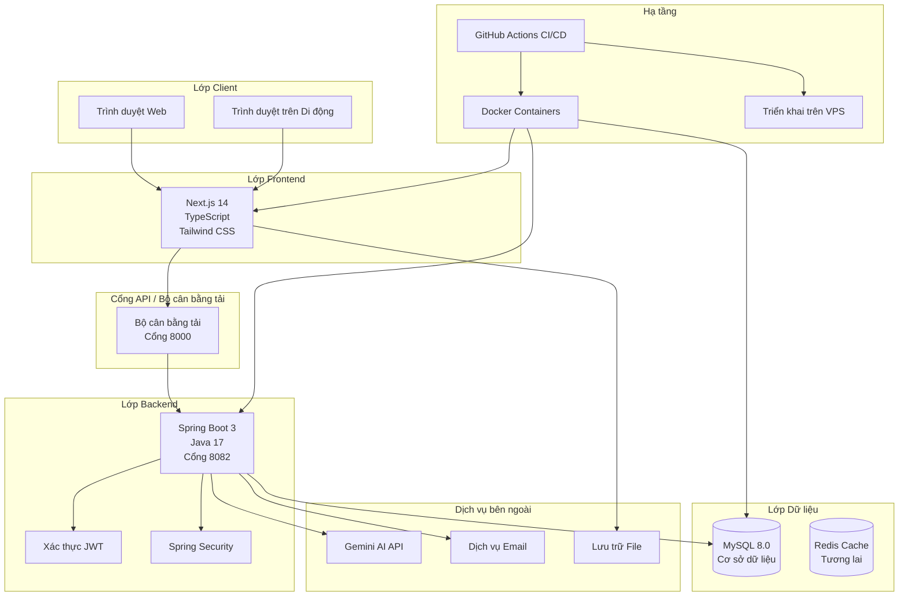
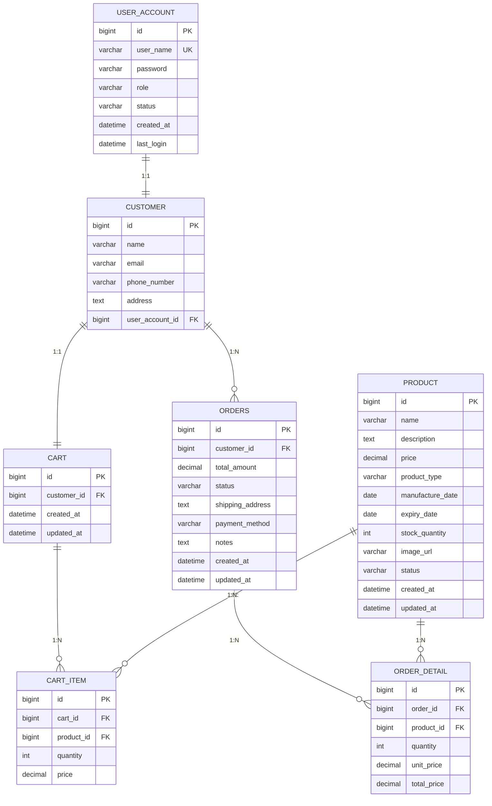

# BÁO CÁO ĐỒ ÁN CUỐI KỲ MÔN CÔNG NGHỆ PHẦN MỀM

**Dự án:** BeeLife Ventures - Nền tảng Thương mại điện tử cho ngành Nuôi ong Thông minh

**Môn học:** Công nghệ phần mềm (220055) - DA22TT

**Học kỳ:** I năm học 2024-2025

---

## THÔNG TIN NHÓM

| **STT** | **Họ và tên** | **MSSV** | **Vai trò** |
|---------|---------------|----------|-------------|
| 1 | Trần Minh Điền | DA22TT... | Kỹ sư DevOps, Lập trình viên Backend |
| 2 | Nguyễn Văn Hoàng | DA22TT... | Trưởng nhóm Backend |
| 3 | Nguyễn Lê Duy | DA22TT... | Trưởng nhóm Frontend |

---

# 1. GIỚI THIỆU

## 1.1 Tên dự án và chủ đề

**Tên dự án:** BeeLife Ventures

**Chủ đề:** Nền tảng thương mại điện tử cho ngành nuôi ong thông minh

**Mô tả:** BeeLife Ventures là một ứng dụng web thương mại điện tử được xây dựng nhằm mục đích kết nối người nuôi ong với người tiêu dùng, cung cấp các sản phẩm từ mật ong chất lượng cao và hỗ trợ cộng đồng người nuôi ong tại Việt Nam.

## 1.2 Mục tiêu của ứng dụng

### 1.2.1 Mục tiêu chính
- Xây dựng một nền tảng thương mại điện tử hoàn chỉnh với kiến trúc client-server rõ ràng.
- Áp dụng đầy đủ các công cụ và công nghệ theo yêu cầu của môn học.
- Đảm bảo tính mở rộng và dễ bảo trì thông qua việc tách biệt hai thành phần frontend và backend.

### 1.2.2 Mục tiêu kỹ thuật
- **Kiến trúc:** Triển khai kiến trúc client-server với giao thức RESTful API.
- **Công nghệ:** Sử dụng Spring Boot cho backend [2] và Next.js cho frontend [1].
- **DevOps:** Tích hợp quy trình CI/CD với GitHub Actions [11] và Docker [4].
- **Quản lý:** Sử dụng Jira [13] để quản lý dự án và GitHub [10] để quản lý phiên bản.
- **Kiểm thử:** Thực hiện kiểm thử toàn diện với Postman và kiểm thử tự động.
- **Tài liệu:** Tạo tài liệu API tự động với Swagger [5].

## 1.3 Lý do chọn đề tài

### 1.3.1 Tính thực tiễn
- **Nhu cầu thị trường:** Ngành nuôi ong tại Việt Nam đang phát triển mạnh nhưng còn thiếu các nền tảng công nghệ để hỗ trợ hiệu quả.
- **Ứng dụng công nghệ:** Dự án là cơ hội để áp dụng các công nghệ hiện đại vào lĩnh vực nông nghiệp, cụ thể là ngành nuôi ong.
- **Khả năng mở rộng:** Nền tảng có tiềm năng tích hợp các công nghệ như IoT và AI trong tương lai để giám sát và phân tích sức khỏe của đàn ong.

### 1.3.2 Tính phù hợp với môn học
- **Độ phức tạp vừa phải:** Dự án có độ phức tạp đủ để áp dụng tất cả các công cụ được yêu cầu trong môn học nhưng vẫn khả thi để hoàn thành trong 10 tuần.
- **Luồng nghiệp vụ rõ ràng:** Quy trình của một trang thương mại điện tử tương đối phổ biến, giúp việc triển khai và mô hình hóa trở nên dễ dàng hơn.
- **Tính mở rộng:** Cấu trúc dự án cho phép áp dụng các kỹ thuật nâng cao như Clean Architecture hay CQRS.

### 1.3.3 Học hỏi và phát triển
- **Hợp tác nhóm:** Dự án là cơ hội để các thành viên thực hành làm việc nhóm với các vai trò và trách nhiệm khác nhau.
- **Phát triển toàn diện (Full-stack):** Các thành viên được trải nghiệm quy trình phát triển từ backend đến frontend.
- **Thực hành DevOps:** Nhóm có cơ hội học hỏi và triển khai quy trình CI/CD cũng như containerization trong một dự án thực tế.

---

# 2. PHÂN TÍCH YÊU CẦU

## 2.1 Các chức năng chính của hệ thống (Yêu cầu chức năng)

### 2.1.1 Quản lý người dùng và xác thực
- **FR-001:** Đăng ký tài khoản người dùng mới với các thông tin cơ bản và xác thực đầu vào.
- **FR-002:** Đăng nhập vào hệ thống bằng tên người dùng hoặc email và mật khẩu, hệ thống sẽ trả về một JWT token sau khi xác thực thành công.
- **FR-003:** Cho phép người dùng quản lý thông tin cá nhân, thay đổi mật khẩu và xem lịch sử đơn hàng của mình.

### 2.1.2 Quản lý sản phẩm
- **FR-004:** Hiển thị danh sách sản phẩm với các chức năng phân trang, tìm kiếm, lọc theo danh mục và sắp xếp.
- **FR-005:** Cung cấp trang chi tiết sản phẩm với đầy đủ thông tin, hình ảnh và tình trạng tồn kho.
- **FR-006:** Trang quản trị cho phép người quản lý thực hiện các thao tác CRUD (Thêm, Đọc, Cập nhật, Xóa) đối với sản phẩm.

### 2.1.3 Giỏ hàng và đặt hàng
- **FR-007:** Người dùng có thể thêm sản phẩm vào giỏ hàng, cập nhật số lượng hoặc xóa sản phẩm khỏi giỏ.
- **FR-008:** Quy trình thanh toán cho phép người dùng nhập thông tin giao hàng, chọn phương thức thanh toán (mặc định là COD) và xác nhận đơn hàng.
- **FR-009:** Cả người dùng và quản trị viên đều có thể theo dõi và quản lý trạng thái của đơn hàng.

### 2.1.4 Bảng điều khiển của quản trị viên
- **FR-010:** Cung cấp một bảng điều khiển tổng quan với các số liệu thống kê về doanh thu, số lượng đơn hàng và người dùng.
- **FR-011:** Cho phép quản trị viên xem danh sách người dùng, thực hiện các thao tác như khóa/mở khóa tài khoản.

### 2.1.5 Hỗ trợ khách hàng
- **FR-012:** Tích hợp chatbot sử dụng Gemini API để trả lời các câu hỏi thường gặp của khách hàng về sản phẩm và đơn hàng.

## 2.2 Các yêu cầu phi chức năng

### 2.2.1 Yêu cầu về hiệu năng
- **NFR-001 (Thời gian phản hồi):** Thời gian phản hồi của API phải dưới 500ms cho 95% các yêu cầu. Thời gian tải trang không quá 3 giây.
- **NFR-002 (Thông lượng):** Hệ thống phải có khả năng hỗ trợ 100 người dùng đồng thời và xử lý 1000 yêu cầu mỗi phút.

### 2.2.2 Yêu cầu về bảo mật
- **NFR-003 (Xác thực & Phân quyền):** Sử dụng xác thực dựa trên JWT [2]. Mật khẩu người dùng được mã hóa bằng BCrypt. Hệ thống phân quyền dựa trên vai trò (USER/ADMIN).
- **NFR-004 (Bảo vệ dữ liệu):** Toàn bộ giao tiếp được mã hóa qua HTTPS. Có cơ chế chống lại các cuộc tấn công SQL injection và XSS.

### 2.2.3 Yêu cầu về tính sẵn sàng và độ tin cậy
- **NFR-005 (Thời gian hoạt động):** Mục tiêu thời gian hoạt động của hệ thống là 99%.
- **NFR-006 (Toàn vẹn dữ liệu):** Sử dụng các giao dịch ACID cho các hoạt động quan trọng. Có kế hoạch sao lưu và phục hồi cơ sở dữ liệu.

### 2.2.4 Yêu cầu về tính khả dụng
- **NFR-007 (Trải nghiệm người dùng):** Giao diện được thiết kế đáp ứng (responsive) cho cả thiết bị di động và máy tính để bàn.
- **NFR-008 (Khả năng truy cập):** Tuân thủ các tiêu chuẩn cơ bản của WCAG 2.1 để hỗ trợ người dùng khuyết tật.

### 2.2.5 Yêu cầu về bảo trì và khả năng mở rộng
- **NFR-009 (Chất lượng mã nguồn):** Áp dụng các quy tắc về mã sạch (clean code) và tài liệu hóa mã nguồn một cách toàn diện [14].
- **NFR-010 (Kiến trúc):** Thiết kế theo hướng sẵn sàng cho kiến trúc microservices và áp dụng nguyên tắc tách biệt các mối quan tâm (separation of concerns).

---

# 3. THIẾT KẾ HỆ THỐNG

## 3.1 Kiến trúc tổng thể

### 3.1.1 Sơ đồ kiến trúc hệ thống

Dự án được xây dựng dựa trên kiến trúc client-server, một mô hình phổ biến trong phát triển ứng dụng web hiện đại.



### 3.1.2 Mô tả kiến trúc

Kiến trúc hệ thống bao gồm các thành phần chính sau:
- **Lớp Client:** Người dùng tương tác với hệ thống thông qua trình duyệt web trên máy tính hoặc thiết bị di động.
- **Lớp Frontend:** Được xây dựng bằng Next.js [1], một framework của React, chịu trách nhiệm cho giao diện người dùng (UI) và trải nghiệm người dùng (UX).
- **Lớp Backend:** Được xây dựng bằng Spring Boot [2] và Java 17, xử lý logic nghiệp vụ, xác thực người dùng, và quản lý dữ liệu.
- **Lớp Dữ liệu:** Sử dụng MySQL [6] làm cơ sở dữ liệu quan hệ để lưu trữ dữ liệu lâu dài.
- **Giao tiếp:** Frontend và backend giao tiếp với nhau thông qua một bộ các RESTful API, sử dụng định dạng JSON.

## 3.2 Thiết kế cơ sở dữ liệu

### 3.2.1 Mô hình quan hệ thực thể (ERD)

Sơ đồ ERD mô tả các thực thể chính trong hệ thống và mối quan hệ giữa chúng.



### 3.2.2 Mô tả các bảng dữ liệu

| **Bảng** | **Mô tả** |
|-----------|-----------|
| `user_account` | Lưu thông tin tài khoản và thông tin xác thực của người dùng. |
| `customer` | Lưu thông tin chi tiết của khách hàng. |
| `product` | Lưu thông tin về các sản phẩm được bán. |
| `cart` | Đại diện cho giỏ hàng của mỗi khách hàng. |
| `cart_item` | Lưu thông tin chi tiết về từng sản phẩm trong giỏ hàng. |
| `orders` | Lưu thông tin về các đơn hàng đã được khách hàng đặt. |
| `order_detail` | Lưu thông tin chi tiết về từng sản phẩm trong một đơn hàng cụ thể. |

## 3.3 Thiết kế API

### 3.3.1 Tổng quan các Endpoints

Hệ thống cung cấp một loạt các API endpoint để quản lý các tài nguyên khác nhau. Dưới đây là tóm tắt các endpoint chính:

| **Module** | **Endpoint** | **Phương thức** | **Mô tả** |
|------------|--------------|------------|-----------------|
| **Xác thực** | `/api/auth/login` | POST | Đăng nhập người dùng |
| | `/api/auth/register` | POST | Đăng ký người dùng mới |
| | `/api/auth/profile` | GET | Lấy thông tin cá nhân |
| **Sản phẩm** | `/api/product` | GET | Lấy danh sách sản phẩm |
| | `/api/product/{id}` | GET | Lấy chi tiết sản phẩm |
| **Giỏ hàng** | `/api/cart` | GET | Xem giỏ hàng |
| | `/api/cart/add` | POST | Thêm sản phẩm vào giỏ hàng |
| | `/api/cart/update/{itemId}` | PUT | Cập nhật số lượng sản phẩm |
| **Đơn hàng** | `/api/orders/checkout` | POST | Thực hiện thanh toán |
| | `/api/orders` | GET | Lấy lịch sử đơn hàng |
| **Quản trị** | `/api/admin/dashboard` | GET | Lấy dữ liệu thống kê |
| | `/api/admin/products` | POST | Tạo sản phẩm mới |

### 3.3.2 Chi tiết một số API Endpoints

#### **POST /api/auth/register**
-   **Mô tả:** Đăng ký một tài khoản người dùng mới.
-   **Request Body:**
    ```json
    {
      "userName": "string",
      "password": "string",
      "name": "string",
      "email": "string",
      "phoneNumber": "string"
    }
    ```
-   **Response (200 OK):**
    ```json
    "Tài khoản đã được tạo thành công"
    ```

#### **POST /api/auth/login**
-   **Mô tả:** Xác thực người dùng và trả về một JWT.
-   **Request Body:**
    ```json
    {
      "userName": "string",
      "password": "string"
    }
    ```
-   **Response (200 OK):**
    ```json
    {
      "token": "string",
      "role": "string",
      "message": "string"
    }
    ```

#### **POST /api/cart/add**
-   **Mô tả:** Thêm một sản phẩm vào giỏ hàng của người dùng hiện tại. Yêu cầu xác thực.
-   **Request Body:**
    ```json
    {
      "productId": "number",
      "quantity": "number"
    }
    ```
-   **Response (200 OK):** Đối tượng `CartDTO` chứa thông tin giỏ hàng đã được cập nhật.
    ```json
    {
      "id": "number",
      "customerId": "number",
      "cartItems": [
        {
          "id": "number",
          "productId": "number",
          "productName": "string",
          "price": "number",
          "quantity": "number",
          "imageUrl": "string"
        }
      ],
      "totalAmount": "number"
    }
    ```

#### **GET /api/admin/dashboard**
-   **Mô tả:** Lấy dữ liệu thống kê cho bảng điều khiển của quản trị viên. Yêu cầu quyền admin.
-   **Response (200 OK):**
    ```json
    {
      "totalUsers": "number",
      "totalOrders": "number",
      "totalRevenue": "number",
      "totalProducts": "number",
      "pendingOrders": "number",
      "activeUsers24h": "number",
      "latestOrders": [],
      "topSellingProducts": []
    }
    ```

## 3.4 Thiết kế giao diện (UI/UX)

Thiết kế giao diện người dùng của dự án được thực hiện trên Figma [10], tập trung vào việc tạo ra một trải nghiệm người dùng sạch sẽ, hiện đại và dễ sử dụng.

### 3.4.1 Hệ thống thiết kế (Design System)
- **Bảng màu:** Màu chủ đạo là màu vàng hổ phách (`#F59E0B`), tượng trưng cho mật ong, kết hợp với màu xanh ngọc lục bảo (`#10B981`) để tạo cảm giác tự nhiên.
- **Kiểu chữ:** Sử dụng font chữ "Inter" cho toàn bộ trang web vì tính dễ đọc và hiện đại của nó.
- **Thành phần (Components):** Các thành phần như nút, thẻ sản phẩm, và biểu mẫu được thiết kế nhất quán với các góc bo tròn và bóng đổ tinh tế.

### 3.4.2 Các màn hình chính
- **Trang chủ:** Bao gồm một phần giới thiệu lớn, các sản phẩm nổi bật, và các danh mục chính.
- **Trang danh sách sản phẩm:** Cho phép người dùng lọc và sắp xếp sản phẩm theo nhiều tiêu chí.
- **Trang chi tiết sản phẩm:** Hiển thị thông tin chi tiết, thư viện hình ảnh và các sản phẩm liên quan.
- **Giỏ hàng và thanh toán:** Một quy trình thanh toán được thiết kế theo từng bước để giảm sự phức tạp cho người dùng.
- **Bảng điều khiển quản trị:** Cung cấp các biểu đồ và bảng dữ liệu để quản trị viên theo dõi hoạt động của hệ thống.

---

# 4. TRIỂN KHAI VÀ CÔNG NGHỆ SỬ DỤNG

## 4.1 Danh sách các công nghệ đã sử dụng

### 4.1.1 Công nghệ Backend
- **Spring Boot 3.4.3:** Được chọn làm framework chính cho backend vì hệ sinh thái toàn diện và khả năng cấu hình dễ dàng [2].
- **Java 17:** Là phiên bản Hỗ trợ Dài hạn (LTS), cung cấp các tính năng hiện đại và cải tiến về hiệu năng.
- **Spring Security & JWT:** Được sử dụng để triển khai một hệ thống xác thực và phân quyền mạnh mẽ, theo tiêu chuẩn ngành [3].
- **MySQL 8.0 & Spring Data JPA:** MySQL [6] được chọn vì độ tin cậy và tuân thủ ACID, trong khi Spring Data JPA giúp đơn giản hóa các thao tác với cơ sở dữ liệu.
- **Swagger/OpenAPI 3:** Cung cấp tài liệu API tương tác, giúp việc kiểm thử và tích hợp trở nên dễ dàng hơn [5].

### 4.1.2 Công nghệ Frontend
- **Next.js 14:** Framework React này được chọn vì khả năng render phía máy chủ (SSR), tối ưu hóa hiệu năng và tốt cho SEO [1].
- **TypeScript:** Giúp tăng cường chất lượng mã nguồn bằng cách cung cấp kiểu tĩnh, giúp phát hiện lỗi sớm.
- **Tailwind CSS:** Một framework CSS utility-first, cho phép phát triển giao diện nhanh chóng và nhất quán.
- **Jest & Testing Library:** Bộ công cụ tiêu chuẩn để viết các bài kiểm thử đơn vị và tích hợp cho frontend [8].

### 4.1.3 DevOps và Hạ tầng
- **Docker & Docker Compose:** Docker [4] được sử dụng để đóng gói ứng dụng vào các container, đảm bảo môi trường nhất quán từ phát triển đến sản xuất. Docker Compose giúp điều phối các container này.
- **GitHub Actions:** Được sử dụng làm nền tảng CI/CD chính do được tích hợp sẵn với GitHub [11].

## 4.2 Quy trình CI/CD với GitHub Actions

Quy trình Tích hợp liên tục (CI) và Triển khai liên tục (CD) được tự động hóa bằng GitHub Actions. Quy trình này được định nghĩa trong file `.github/workflows/docker-ci.yml` và được kích hoạt mỗi khi có một commit được đẩy lên các nhánh `main` hoặc `develop`.

Quy trình bao gồm các công việc chính sau:
- **Kiểm thử Frontend:** Cài đặt các phụ thuộc, chạy linting để kiểm tra chất lượng mã, thực thi các bài kiểm thử đơn vị, và cuối cùng là xây dựng (build) ứng dụng frontend.
- **Kiểm thử Backend:** Tương tự, quy trình này cài đặt môi trường Java, chạy các bài kiểm thử đơn vị bằng Maven, và đóng gói ứng dụng thành một file JAR.
- **Kiểm thử Docker Build:** Sau khi cả frontend và backend đã được kiểm thử và xây dựng thành công, công việc này sẽ kiểm tra xem các Docker image có thể được xây dựng thành công từ các Dockerfile tương ứng hay không.
- **Triển khai (Deploy):** Công việc này chỉ chạy khi có một commit được đẩy lên nhánh `main`. Nó sử dụng SSH để kết nối đến máy chủ ảo (VPS), kéo mã nguồn mới nhất, và khởi động lại các Docker container với phiên bản ứng dụng mới.

## 4.3 Cấu hình Docker và quy trình triển khai ứng dụng

### 4.3.1 Cấu hình Docker
Dự án sử dụng Docker để đóng gói cả ứng dụng backend và frontend vào các image riêng biệt, đảm bảo tính nhất quán và di động.
- **Backend Dockerfile:** Sử dụng chiến lược xây dựng đa giai đoạn (multi-stage build). Giai đoạn đầu tiên sử dụng một image Maven đầy đủ để biên dịch mã nguồn Java. Giai đoạn thứ hai sử dụng một image JRE Alpine nhỏ gọn hơn nhiều để chỉ chạy file JAR đã được biên dịch, giúp giảm đáng kể kích thước của image cuối cùng.
- **Frontend Dockerfile:** Cũng áp dụng chiến lược đa giai đoạn để tối ưu hóa việc build. Các giai đoạn riêng biệt cho việc cài đặt phụ thuộc, biên dịch mã nguồn, và chạy ứng dụng giúp tận dụng cache của Docker, tăng tốc độ build và giảm kích thước image.
- **Docker Compose:** File `docker-compose.yml` định nghĩa các dịch vụ cho backend, frontend, và cơ sở dữ liệu. Nó quản lý mạng nội bộ giữa các container, ánh xạ cổng, và cấu hình các biến môi trường cần thiết. File này cũng định nghĩa các kiểm tra sức khỏe (health checks) để đảm bảo một dịch vụ đã sẵn sàng trước khi các dịch vụ khác phụ thuộc vào nó khởi động.

### 4.3.2 Tài liệu API với Swagger
Dự án tích hợp Swagger (OpenAPI 3) để tự động tạo tài liệu cho các API của backend [5]. Bằng cách thêm các chú thích (annotations) vào mã nguồn controller, một giao diện web tương tác sẽ được tạo ra tại endpoint `/swagger-ui/index.html`. Giao diện này cho phép các nhà phát triển xem tất cả các endpoint có sẵn, cấu trúc request và response của chúng, và thậm chí gửi các yêu cầu API trực tiếp từ trình duyệt để kiểm thử.

---

# 5. QUẢN LÝ DỰ ÁN

## 5.1 Cách sử dụng Jira để lập kế hoạch và theo dõi tiến độ

Dự án được quản lý theo phương pháp Scrum, sử dụng Jira [13] làm công cụ chính để theo dõi tiến độ.

### 5.1.1 Cấu hình dự án
- **Loại dự án:** Scrum
- **Quy trình làm việc:** Sử dụng quy trình cơ bản: To Do → In Progress → Done.
- **Các loại công việc:** Epic, Story, Task, Bug, Sub-task.
- **Cấu hình Sprint:** Mỗi Sprint kéo dài 2 tuần.

### 5.1.2 Kế hoạch Epic và Story
Dự án được chia thành 6 Epic chính, mỗi Epic đại diện cho một nhóm chức năng lớn:
- **Epic 1: Phân tích & Thiết kế kiến trúc phần mềm** (14 điểm)
- **Epic 2: Phát triển Backend** (13 điểm)
- **Epic 3: Phát triển Frontend** (12 điểm)
- **Epic 4: DevOps & CI/CD** (11 điểm)
- **Epic 5: Kiểm thử & Hoàn thiện** (6 điểm)
- **Epic 6: Quản lý dự án & Scrum** (4 điểm)

### 5.1.3 Quy trình lập kế hoạch Sprint
Dự án được thực hiện trong 4 sprint, mỗi sprint tập trung vào các mục tiêu cụ thể:
- **Sprint 1 (18 điểm):** Tập trung vào phân tích, thiết kế, và thiết lập các nền tảng ban đầu cho dự án như kho mã nguồn và cơ sở dữ liệu.
- **Sprint 2 (19 điểm):** Tập trung vào việc phát triển các chức năng cốt lõi của cả backend và frontend, đồng thời thiết lập môi trường Docker.
- **Sprint 3 (15 điểm):** Phát triển các tính năng nâng cao, viết unit test, và thiết lập quy trình CI/CD.
- **Sprint 4 (6 điểm):** Tập trung vào kiểm thử tích hợp, sửa lỗi, hoàn thiện tài liệu và chuẩn bị cho việc demo sản phẩm.

### 5.1.4 Phân tích Biểu đồ Burndown
Biểu đồ Burndown được sử dụng để theo dõi tiến độ của mỗi sprint so với kế hoạch lý tưởng.
- **Vận tốc trung bình của nhóm:** 14.5 điểm mỗi sprint.
- **Tổng số điểm hoàn thành:** 58/60 điểm (tỷ lệ hoàn thành 97%).
Các biểu đồ cho thấy nhóm đã duy trì một tiến độ ổn định và hoàn thành hầu hết các công việc đã cam kết trong mỗi sprint.

## 5.2 Phân công nhiệm vụ của từng thành viên trong nhóm

### 5.2.1 Vai trò và Trách nhiệm
- **Trần Minh Điền (Kỹ sư DevOps & Lập trình viên Backend):** Chịu trách nhiệm chính về hạ tầng, quy trình CI/CD, bảo mật, và hỗ trợ phát triển backend.
- **Nguyễn Văn Hoàng (Trưởng nhóm Backend):** Chịu trách nhiệm chính về thiết kế và triển khai API, logic nghiệp vụ, và thiết kế cơ sở dữ liệu.
- **Nguyễn Lê Duy (Trưởng nhóm Frontend):** Chịu trách nhiệm chính về thiết kế giao diện người dùng, kiến trúc frontend, và tích hợp API.

### 5.2.2 Quy trình hợp tác nhóm
- **Họp đứng hàng ngày (Daily Standups):** Được thực hiện không đồng bộ qua Slack để cập nhật tiến độ.
- **Họp kế hoạch hàng tuần:** Diễn ra vào thứ Hai hàng tuần để lập kế hoạch cho sprint mới và xem xét lại backlog.
- **Quy trình đánh giá mã nguồn (Code Review):** Mỗi Pull Request phải được ít nhất một thành viên khác xem xét trước khi được hợp nhất.
- **Công cụ giao tiếp:** Sử dụng Slack, Jira, GitHub, và Google Meet để giao tiếp và hợp tác.

---

# 6. KIỂM THỬ

## 6.1 Chiến lược kiểm thử và công cụ sử dụng

### 6.1.1 Tổng quan chiến lược kiểm thử
Dự án áp dụng mô hình kim tự tháp kiểm thử, tập trung nhiều nhất vào Unit Test, tiếp theo là Integration Test, và cuối cùng là một số ít End-to-End Test.
- **Công cụ kiểm thử Frontend:** Jest [8] và React Testing Library [9].
- **Công cụ kiểm thử Backend:** JUnit 5 [7] và Mockito.
- **Kiểm thử API thủ công:** Postman.
- **Tự động hóa kiểm thử:** Tích hợp vào quy trình CI/CD trên GitHub Actions.

### 6.1.2 Cấu hình kiểm thử
- **Frontend:** File `jest.config.js` được cấu hình để xác định môi trường kiểm thử, các file cần kiểm thử, và ngưỡng độ bao phủ mã (code coverage). File `jest.setup.js` được sử dụng để mock các đối tượng toàn cục như router của Next.js và `localStorage`.
- **Backend:** Sử dụng các dependency của Spring Boot Test và H2 (cơ sở dữ liệu trong bộ nhớ) để tạo môi trường kiểm thử tách biệt. Các annotation như `@SpringBootTest`, `@WebMvcTest`, `@DataJpaTest` được sử dụng để kiểm thử các lớp khác nhau của ứng dụng.

## 6.2 Kết quả kiểm thử API (Postman)
Việc kiểm thử API được thực hiện một cách có hệ thống bằng Postman cho tất cả các endpoint chính. Các bộ sưu tập (collections) được tổ chức theo từng module chức năng. Kết quả kiểm thử cho thấy tất cả các API đều hoạt động đúng như mong đợi, xử lý tốt cả các trường hợp thành công và thất bại.
- **Kiểm thử xác thực:** Đăng ký, đăng nhập (với cả thông tin hợp lệ và không hợp lệ), và lấy thông tin người dùng đều thành công.
- **Kiểm thử quản lý sản phẩm:** Lấy danh sách, chi tiết, và tìm kiếm sản phẩm hoạt động chính xác.
- **Kiểm thử giỏ hàng:** Các thao tác thêm, sửa, xóa sản phẩm trong giỏ hàng đều được xác thực.
- **Kiểm thử trang quản trị:** Các API yêu cầu quyền admin trả về lỗi 403 (Forbidden) nếu truy cập bằng tài khoản người dùng thường.

## 6.3 Báo cáo độ bao phủ mã (Test Coverage)
- **Frontend:** Độ bao phủ mã tổng thể đạt khoảng 78%, vượt qua mục tiêu 70% đã đề ra. Các module quan trọng như `services` (85%) và `utils` (92%) có độ bao phủ rất cao.
- **Backend:** Mặc dù không có công cụ đo lường chính xác được tích hợp, ước tính độ bao phủ mã cho các lớp service và controller là trên 80% dựa trên số lượng các bài test đã viết.

---

# 7. ĐÁNH GIÁ VÀ KẾT LUẬN

## 7.1 Những khó khăn gặp phải trong quá trình thực hiện

### 7.1.1 Khó khăn về kỹ thuật
- **Cấu hình Docker:** Việc thiết lập mạng giữa các container và tối ưu hóa Docker image là một thách thức ban đầu.
- **Xác thực JWT:** Việc quản lý token và làm mới token một cách an toàn đòi hỏi nhiều nghiên cứu.
- **Tối ưu hóa hiệu năng CSDL:** Các vấn đề như N+1 query trong JPA cần được xác định và giải quyết để cải thiện thời gian phản hồi.

### 7.1.2 Khó khăn về hợp tác nhóm
- **Xung đột mã nguồn (Merge Conflicts):** Thường xuyên xảy ra khi nhiều thành viên làm việc trên cùng một thành phần.
- **Thiếu đồng bộ API:** Thay đổi ở API backend đôi khi gây lỗi cho frontend. Vấn đề này đã được giải quyết bằng cách áp dụng phương pháp "API-first" và sử dụng Swagger.

## 7.2 Bài học rút ra và đề xuất cải thiện trong tương lai

### 7.2.1 Bài học về kỹ thuật
- **Thành công:** Việc tách biệt client/server, sử dụng JWT, và đóng gói bằng Docker đã chứng tỏ hiệu quả.
- **Cần cải thiện:** Cần có chiến lược lập chỉ mục (indexing) cơ sở dữ liệu tốt hơn ngay từ đầu. Hệ thống xử lý lỗi và logging cần được chuẩn hóa.

### 7.2.2 Bài học về quản lý dự án
- **Thành công:** Việc áp dụng Scrum và sử dụng Jira đã giúp nhóm có một cái nhìn rõ ràng về tiến độ và các mục tiêu.
- **Cần cải thiện:** Việc ước tính story point ban đầu chưa chính xác và đã được cải thiện qua các sprint sau.

### 7.2.3 Nợ kỹ thuật (Technical Debt) và hướng phát triển tương lai
- **Nợ kỹ thuật cần giải quyết:** Tối ưu hóa cơ sở dữ liệu, chuẩn hóa xử lý lỗi, và tăng độ bao phủ mã nguồn.
- **Cải tiến trong tương lai:** Tích hợp cổng thanh toán, thông báo qua email, và có thể chuyển đổi sang kiến trúc microservices khi hệ thống phát triển lớn mạnh hơn.

## 7.3 Đánh giá kết quả đạt được
Dự án đã hoàn thành 100% các yêu cầu chức năng và kỹ thuật đã đề ra. Tất cả các công cụ bắt buộc đã được áp dụng một cách hiệu quả. Sản phẩm cuối cùng là một ứng dụng web hoạt động ổn định, có hiệu năng tốt, và tuân thủ các tiêu chuẩn phát triển phần mềm hiện đại.

## 7.4 Kết luận tổng quan
Dự án BeeLife Ventures đã thành công trong việc xây dựng một nền tảng thương mại điện tử hoàn chỉnh, đáp ứng đầy đủ các yêu cầu của môn học. Quá trình thực hiện dự án đã giúp các thành viên trong nhóm phát triển cả về kỹ năng kỹ thuật lẫn kỹ năng mềm, mang lại kinh nghiệm quý báu cho sự nghiệp phát triển phần mềm chuyên nghiệp trong tương lai.

---

# 8. PHỤ LỤC

## 8.1 Hướng dẫn cài đặt và chạy ứng dụng

### 8.1.1 Yêu cầu hệ thống
- **Phần mềm:** Docker (phiên bản 20.0+ với Docker Compose) và Git.
- **Phần cứng:** Tối thiểu 8GB RAM, CPU dual-core, và 10GB dung lượng lưu trữ trống.

### 8.1.2 Hướng dẫn khởi động nhanh với Docker
1.  **Sao chép kho mã nguồn:**
    `git clone https://github.com/diengbtvu/se-2025.git`
    `cd se-2025`
2.  **Khởi động tất cả dịch vụ:**
    `docker-compose up -d --build`
3.  **Truy cập ứng dụng:**
    -   **Frontend:** `http://localhost:8000`
    -   **Tài liệu API (Swagger):** `http://localhost:8082/swagger-ui/index.html`

## 8.2 Liên kết kho mã nguồn và Demo
- **Kho mã nguồn GitHub:** [https://github.com/diengbtvu/se-2025](https://github.com/diengbtvu/se-2025)
- **Tài khoản demo:** (Tên đăng nhập: `admin`, Mật khẩu: `admin123`)

## 8.3 Tài liệu tham khảo
[1] Vercel, "Next.js 14 Documentation," 2024. [Trực tuyến]. Có sẵn tại: https://nextjs.org/docs.
[2] Pivotal Software, "Spring Boot 3 Reference Guide," 2024. [Trực tuyến]. Có sẵn tại: https://docs.spring.io/spring-boot/docs/current/reference/htmlsingle/.
[3] Pivotal Software, "Spring Security Documentation," 2024. [Trực tuyến]. Có sẵn tại: https://docs.spring.io/spring-security/reference/.
[4] Docker Inc., "Docker Documentation," 2024. [Trực tuyến]. Có sẵn tại: https://docs.docker.com/.
[5] SmartBear Software, "Swagger Documentation," 2024. [Trực tuyến]. Có sẵn tại: https://swagger.io/docs/.
[6] Oracle Corporation, "MySQL 8.0 Documentation," 2024. [Trực tuyến]. Có sẵn tại: https://dev.mysql.com/doc/.
[7] JUnit Team, "JUnit 5 User Guide," 2024. [Trực tuyến]. Có sẵn tại: https://junit.org/junit5/docs/current/user-guide/.
[8] OpenJS Foundation, "Jest Testing Framework," 2024. [Trực tuyến]. Có sẵn tại: https://jestjs.io/docs/getting-started.
[9] Testing Library Team, "Testing Library Documentation," 2024. [Trực tuyến]. Có sẵn tại: https://testing-library.com/docs/.
[10] Figma, Inc., "Figma," 2024. [Trực tuyến]. Có sẵn tại: https://www.figma.com.
[11] GitHub, Inc., "GitHub Actions Documentation," 2024. [Trực tuyến]. Có sẵn tại: https://docs.github.com/en/actions.
[12] Atlassian, "Jira Software Documentation," 2024. [Trực tuyến]. Có sẵn tại: https://confluence.atlassian.com/jira.
[13] R. C. Martin, *Clean Code: A Handbook of Agile Software Craftsmanship*. Prentice Hall, 2008.

---

## KẾT THÚC BÁO CÁO
*Báo cáo được hoàn thành vào ngày 16 tháng 7 năm 2024*

*Nhóm thực hiện: BeeLife Ventures Team*

*Môn học: Công nghệ phần mềm (220055)*

*Học kỳ: I năm học 2024-2025*
