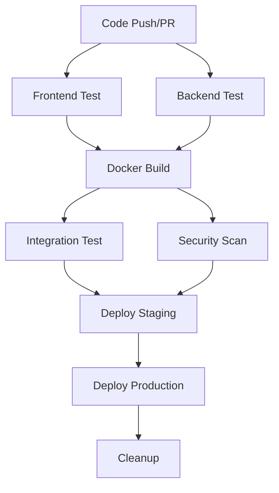
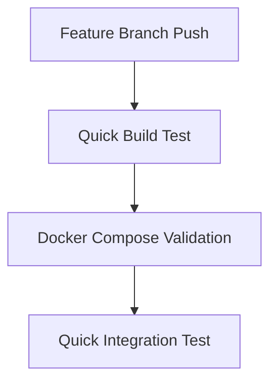

# 🚀 CI/CD Guide - BeeLifeVentures

Hướng dẫn chi tiết về hệ thống CI/CD được thiết lập cho dự án BeeLifeVentures sử dụng GitHub Actions.

## 📋 Tổng quan

Dự án sử dụng **GitHub Actions** cho CI/CD với 4 workflows chính:

| Workflow | Mục đích | Trigger |
|----------|----------|---------|
| 🏗️ **docker-ci.yml** | Full CI/CD pipeline | Push to main/develop, PRs |
| ⚡ **quick-build.yml** | Quick build & test | Push to feature branches |
| 🤖 **dependabot-auto-merge.yml** | Auto-merge dependencies | Dependabot PRs |
| 📦 **dependabot.yml** | Dependency updates | Scheduled weekly/monthly |

## 🔄 CI/CD Pipeline Flow

### 1. **Full Pipeline** (docker-ci.yml)



### 2. **Quick Pipeline** (quick-build.yml)



## 🏗️ Workflows Chi tiết

### 🎯 1. Main CI/CD Pipeline

**File**: `.github/workflows/docker-ci.yml`

#### Jobs Overview

1. **frontend-test** 🧪
   - Setup Node.js 18
   - Install dependencies với npm ci
   - Run linting (ESLint)
   - Run tests với coverage
   - Build frontend với Next.js
   - Upload coverage to Codecov

2. **backend-test** ⚙️
   - Setup Java 17 (Eclipse Temurin)
   - Run Maven tests
   - Generate test reports
   - Build JAR package
   - Upload test artifacts

3. **docker-build** 🐳
   - Matrix build (frontend + backend)
   - Build Docker images với Buildx
   - Push to GitHub Container Registry
   - Cache layers để tăng tốc

4. **integration-test** 🔧
   - Chỉ chạy cho Pull Requests
   - Start full stack với docker-compose
   - Test API endpoints
   - Test frontend accessibility
   - Show logs nếu fail

5. **security-scan** 🔒
   - Scan vulnerabilities với Trivy
   - Upload results to GitHub Security
   - Matrix scan cho cả FE và BE

6. **deploy-staging** 🚀
   - Auto deploy develop branch
   - Run smoke tests
   - Environment protection

7. **deploy-production** 🌟
   - Manual deploy main branch
   - Environment protection
   - Team notifications
   - Post-deploy verification

8. **cleanup** 🧹
   - Delete old Docker images
   - Keep 5 latest versions
   - Save registry space

### ⚡ 2. Quick Build Workflow

**File**: `.github/workflows/quick-build.yml`

- **Trigger**: Feature branches (excluding main/develop)
- **Purpose**: Fast feedback cho development
- **Duration**: ~3-5 phút

#### Features:
- Build test cả FE và BE
- Validate docker-compose config
- Quick integration test
- Lint checking

### 🤖 3. Dependabot Integration

**Files**: 
- `.github/dependabot.yml` - Config auto-updates
- `.github/workflows/dependabot-auto-merge.yml` - Auto-merge logic

#### Auto-update Schedule:
- **Frontend (npm)**: Weekly Mondays 9:00 AM
- **Backend (Maven)**: Weekly Mondays 10:00 AM  
- **Docker**: Monthly
- **GitHub Actions**: Monthly

#### Auto-merge Rules:
- ✅ **Patch updates** (1.0.1 → 1.0.2) - Auto-merge
- ✅ **Minor updates** (1.0.0 → 1.1.0) - Auto-merge
- ⚠️ **Major updates** (1.0.0 → 2.0.0) - Manual review required

## 🔧 Configuration

### Environment Variables

```bash
# Registry settings
REGISTRY=ghcr.io
IMAGE_NAME=${{ github.repository }}

# Build-time variables
NEXT_PUBLIC_API_URL=http://backend:8080
```

### Secrets Required

| Secret | Purpose | Where to set |
|--------|---------|-------------|
| `GITHUB_TOKEN` | Push to registry | Auto-provided |
| Custom secrets | Deployment keys | Repository Settings |

### Branch Protection

Recommended branch protection cho `main`:

```yaml
Required status checks:
  - frontend-test
  - backend-test
  - docker-build
  - integration-test (for PRs)
  
Require branches to be up to date: ✅
Require review from code owners: ✅
Dismiss stale reviews: ✅
Include administrators: ✅
```

## 🚀 Deployment Environments

### 🧪 Staging Environment

- **Branch**: `develop`
- **URL**: `https://staging.beelife.vn`
- **Auto-deploy**: ✅ Sau khi pass all tests
- **Purpose**: QA testing, integration testing

### 🌟 Production Environment

- **Branch**: `main`
- **URL**: `https://beelife.vn`
- **Auto-deploy**: ❌ Manual approval required
- **Purpose**: Live production environment

### Environment Setup

1. **Create Environments** trong GitHub:
   ```
   Repository Settings → Environments → New Environment
   ```

2. **Set Protection Rules**:
   - Required reviewers
   - Wait timer
   - Deployment branches

3. **Add Environment Secrets**:
   - Deployment keys
   - Database credentials
   - API keys

## 📊 Monitoring & Alerts

### Build Status Badges

Thêm vào README.md:

```markdown
[](https://github.com/your-org/se-2025/actions/workflows/docker-ci.yml)
[](https://github.com/your-org/se-2025/actions/workflows/quick-build.yml)
```

### Notifications

Setup trong workflow:

```yaml
- name: Notify on failure
  if: failure()
  uses: 8398a7/action-slack@v3
  with:
    status: failure
    webhook_url: ${{ secrets.SLACK_WEBHOOK }}
```

## 🛠️ Development Workflow

### Feature Development

1. **Create feature branch**:
   ```bash
   git checkout -b feature/amazing-feature
   ```

2. **Develop & commit**:
   ```bash
   git commit -m "feat: add amazing feature"
   ```

3. **Push triggers quick-build**:
   ```bash
   git push origin feature/amazing-feature
   ```

4. **Create PR** → Triggers full CI/CD

### Hotfix Workflow

1. **Create hotfix branch**:
   ```bash
   git checkout -b hotfix/critical-bug
   ```

2. **Fix & push** → Quick build

3. **PR to main** → Full pipeline

4. **Emergency deploy** (if needed):
   ```bash
   # Manual workflow dispatch
   gh workflow run docker-ci.yml
   ```

## 🔍 Troubleshooting

### Common Issues

#### 1. **Build Failures**

```bash
# Check workflow logs
gh run list --workflow=docker-ci.yml
gh run view <run-id>

# Local debugging
docker-compose build --no-cache
./run-app.sh logs
```

#### 2. **Test Failures**

```bash
# Frontend tests
cd fe && npm test

# Backend tests  
cd be/se-cnpm-beelifeventures && mvn test

# Integration tests
./run-app.sh start
curl http://localhost:8080/api/product
```

#### 3. **Docker Issues**

```bash
# Check Docker build context
docker build -t test-fe ./fe
docker build -t test-be ./be/se-cnpm-beelifeventures

# Validate compose
docker-compose config
```

#### 4. **Permission Issues**

- Check `GITHUB_TOKEN` permissions
- Verify branch protection rules
- Ensure environment access

### Debug Commands

```bash
# View workflow runs
gh run list

# Watch specific run
gh run view <run-id> --log

# Re-run failed workflow
gh run rerun <run-id>

# Manual trigger
gh workflow run docker-ci.yml
```

## 📈 Performance Optimization

### Build Optimization

1. **Docker Layer Caching**:
   ```yaml
   cache-from: type=gha
   cache-to: type=gha,mode=max
   ```

2. **Dependency Caching**:
   ```yaml
   - uses: actions/cache@v3
     with:
       path: ~/.npm
       key: ${{ runner.os }}-node-${{ hashFiles('**/package-lock.json') }}
   ```

3. **Parallel Jobs**:
   ```yaml
   strategy:
     matrix:
       service: [frontend, backend]
   ```

### Cost Optimization

- Use `if` conditions để skip unnecessary jobs
- Matrix builds cho efficiency
- Cleanup old artifacts
- Optimize Docker images

## 🔒 Security Best Practices

### Secrets Management

- ❌ **Never** commit secrets to code
- ✅ Use GitHub Secrets cho sensitive data
- ✅ Rotate secrets regularly
- ✅ Use environment-specific secrets

### Image Security

- ✅ Scan images với Trivy
- ✅ Use official base images
- ✅ Keep images updated
- ✅ Minimize attack surface

### Access Control

- ✅ Require code reviews
- ✅ Branch protection rules
- ✅ Environment approvals
- ✅ Audit logs monitoring

## 📚 Resources

### GitHub Actions

- [GitHub Actions Documentation](https://docs.github.com/en/actions)
- [Workflow Syntax](https://docs.github.com/en/actions/using-workflows/workflow-syntax-for-github-actions)
- [Security Hardening](https://docs.github.com/en/actions/security-guides/security-hardening-for-github-actions)

### Docker

- [Docker Best Practices](https://docs.docker.com/develop/dev-best-practices/)
- [Multi-stage Builds](https://docs.docker.com/develop/dev-best-practices/)

### Project Specific

- [Project Overview](./PROJECT_OVERVIEW.md)
- [Docker Guide](../DOCKER_README.md)
- [Contributing Guidelines](../CONTRIBUTING.md)

---

**Last Updated**: January 2025  
**Maintainer**: BeeLife DevOps Team 